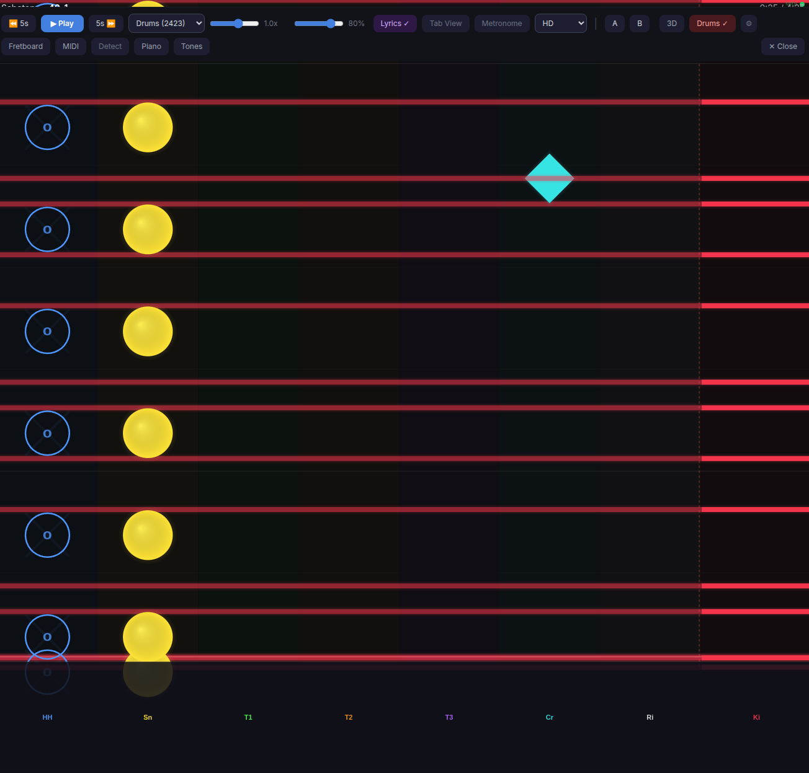
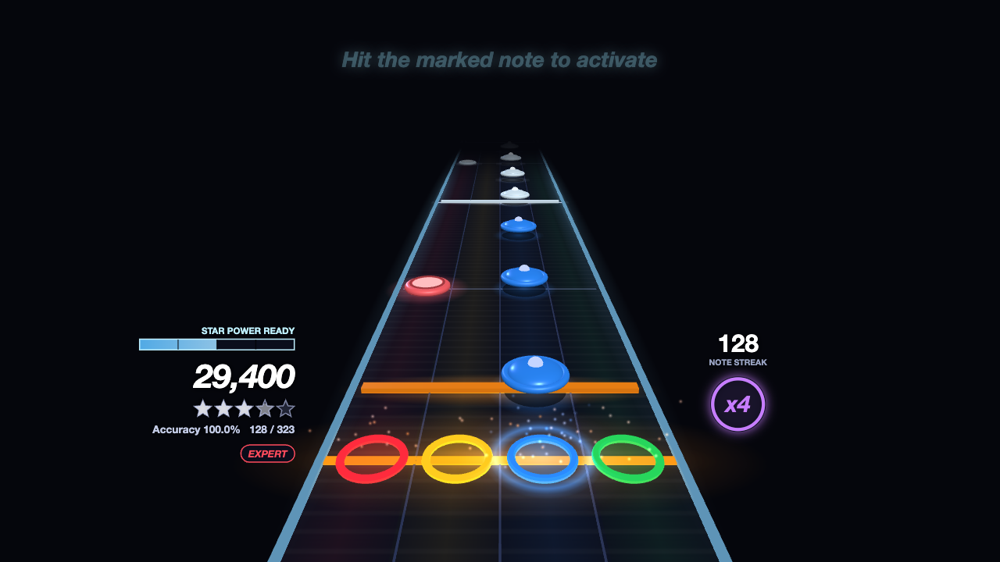
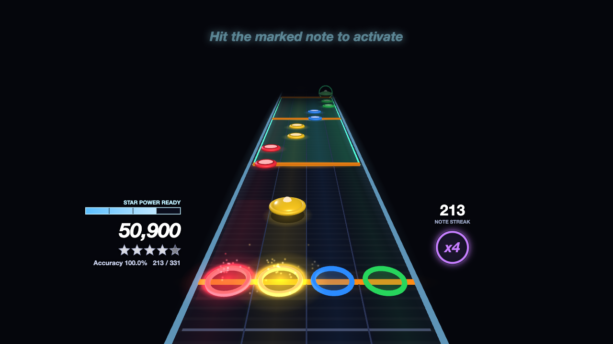
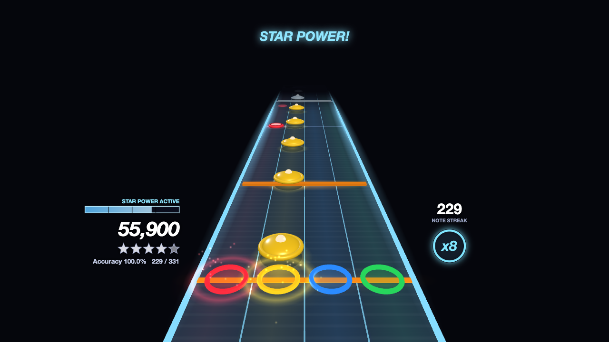
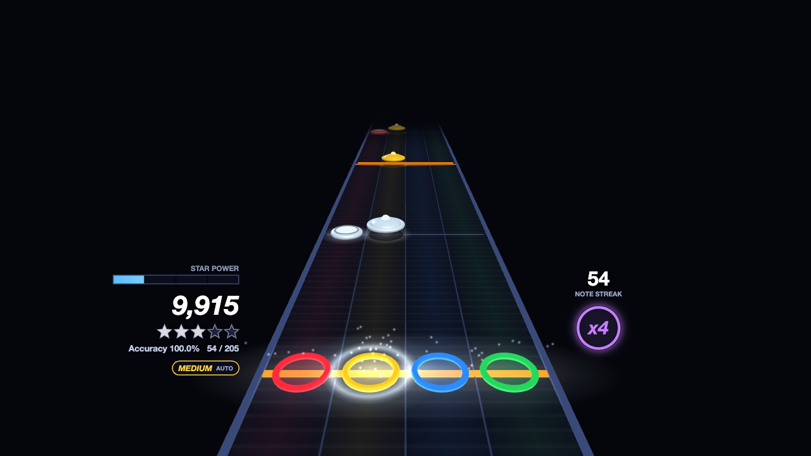

# Slopsmith Plugin: Drum Highway



A plugin for [Slopsmith](https://github.com/got-feedback/feedback) that replaces the guitar highway with a lane-based drum view, with MIDI drum pad input and a built-in drum kit synthesizer.

## Features

- **3D drum track** (default when the browser has WebGL2) — a perspective highway with four pad lanes, a full-width kick bar, star power, drum fills and a score HUD, scored by the plugin's drums engine (`engine.js`). See [3D view](#3d-view).
- **2D lane view** — the original lane renderer described below, still available (View setting, or automatically without WebGL2)
- **Difficulty** — Easy, Medium, Hard, Expert or Expert+ per player (browser), in both views; changeable mid-song. See [Difficulty](#difficulty).
- **Lane-based drum highway** — 8 horizontal lanes (Hi-Hat, Snare, Tom 1-3, Crash, Ride, Kick) with notes scrolling right to left
- **Kick drum full-width bars** — kick hits render as wide horizontal bars spanning the highway, like open string notes on the guitar highway
- **Distinct note shapes** — circles for toms/snare, diamonds for cymbals, X shapes for hi-hat, full bars for kick
- **Hi-hat variations** — closed (filled X), pedal (small X at bottom), open (ring with "o" inside)
- **Neon glow effects** — each drum piece has a unique color with multi-layer glow
- **Velocity-based sizing** — louder hits are bigger, ghost notes are smaller
- **Auto-activate** — switches on automatically for Drums/Percussion arrangements
- **MIDI drum pad input** — connect any MIDI drum pad, electronic kit, or controller via Web MIDI API
- **Custom MIDI mapping** — "Learn" mode to assign any MIDI note to any lane, for non-standard drum pads
- **Built-in drum sounds** — real sampled acoustic kits with velocity layers (or WebAudioFont GM kits) played on each pad hit
- **Accuracy scoring** — hit detection with tight +/-50ms timing window, accuracy %, streak counter
- **Inline settings** — MIDI device, volume, channel filter, lane labels, hit detection, and mapping table
- **Drums settings page** — Plugins → **Drums**: every drum setting on one page, plus a pad tester. See [Settings page](#settings-page).
- **Assists** — auto kick, auto cymbals (each up to a chosen difficulty) and hit-timing presets. See [Assists](#assists).
- **Six drum kits** for the built-in sounds: two real multi-sampled kits — **Crocell** (rock, default) and
  **Virtuosity** (jazz) — and four WebAudioFont GM kits (JCLive, FluidR3 GM, Sound Blaster Live!, Chaos)

## 3D view



| Star power ready, fill ahead | Star power active |
|---|---|
|  |  |

The 3D view is a WebGL renderer (`highway3d.js`, built on the three.js copy that ships with Slopsmith core)
in the style of the classic drum games:

- **Lanes** — red, yellow, blue and green pad lanes plus an orange kick bar across the whole track. Pad
  targets sit on the strikeline at the bottom; the track recedes into the distance.
- **Gems** — snare and toms are flat round "drum head" pucks; cymbals (hi-hat, ride, crash) are raised domes
  with a bell and a ring, floating over a shadow; kicks are wide orange bars, double-bass (2x) kicks are
  magenta with a white stripe. Accents are bigger and brighter, ghost notes smaller and translucent. Missed
  notes go grey and slide past the strikeline.
- **Feedback** — a hit sends a ring flash and sparks up from its pad; a miss or a hit on an empty lane
  (overhit) flashes the lane red. Beat and measure lines scroll with the chart.
- **Star power** — notes in a star power phrase are silver-white. Completing a phrase fills a quarter of the
  meter; at half a meter, drum-fill sections are highlighted in green and the note that ends the fill gets
  a spinning ring: hit it to activate. While active the track edges glow blue and the multiplier doubles
  (up to x8).
- **HUD** — score, star rating (5 stars + gold), accuracy and notes hit, the difficulty badge, star power
  meter, note streak and the multiplier badge (x1-x4, x8 in star power, with a ring showing progress to the
  next multiplier).
  Core draw hooks (`window.highway.fireDrawHooks`) run on the HUD canvas, so overlay plugins still work.

Scoring follows the YARG drums rules ported in `engine.js` (hit window ±70 ms, 10 notes per multiplier
step, star power bar of 8 measures, etc.; see the header of `engine.js`). The 2D view keeps its own simple
±50 ms hit counter.

### Choosing the view

The plugin registers one picker entry, **Drum Highway** (`window.slopsmithViz_drums`), which Slopsmith's
**Auto** mode picks for Drums / Percussion arrangements. Each time it creates a renderer it reads the
**View** setting in the drum settings panel (gear button):

- **Auto** (default) — 3D when WebGL2 is available, otherwise 2D.
- **3D** / **2D** — always that view (3D still falls back to 2D without WebGL2).

Changing the setting swaps the renderer in the main player right away; in splitscreen the panels pick it
up the next time their renderer is created. `window.slopsmithViz_drums3d` / `slopsmithViz_drums2d` are
also exported for hosts that want one view regardless of the setting (they are not in the picker).

### Input

- **MIDI kit** — the same device, channel filter and synth as the 2D view. A pad's MIDI note goes through
  your **Learn / custom mapping** if it has an entry (hi-hat → yellow cymbal, snare → red, tom 1/2/3 →
  yellow/blue/green tom, ride → blue cymbal, crash → green cymbal, kick → kick); otherwise the standard
  General MIDI drum map is used (`DrumsEngine.padFromMidi`: 38/37/40 red, 42/46 hi-hat, 48/50 yellow tom,
  45/47 blue tom, 41/43 green tom, 51/53/59 ride, 49/57/55/52 crash, 36/35 kick; the hi-hat pedal 44 is
  ignored). The 2D lane presets do not apply to the 3D view, which always uses the four-lane pro layout.
  Velocity is passed on for accent/ghost bonus points.
- **Keyboard** (setting **Keys**, on by default) — for trying the view without a kit:

  | Key | Pad |
  |---|---|
  | B | kick |
  | F | red (snare) |
  | J / K / L | yellow / blue / green tom |
  | Shift+J/K/L, or U / I / O | yellow / blue / green cymbal |
  | Enter | activate star power (only when the chart has no drum fills) |

  The keys work only while the 3D view is visible and focused (in splitscreen: the focused panel), and not
  while you type in a text field. Space stays play/pause. **D** / **Shift+D** (harder / easier difficulty)
  work in both views whether or not Keys is on.
- **Offset** (ms) — subtracted from the song time of every hit in the 3D view. Raise it if your hits register
  late (audio output or MIDI latency). Hits that arrive between frames are placed using the current
  playback rate, so timing is not quantised to the frame rate.

### Difficulty



Each player picks **Easy**, **Medium**, **Hard**, **Expert** or **Expert+**. The choice is stored per
browser (`localStorage` key `drums_difficulty_v1`, default Expert), so in splitscreen / multiplayer every
player keeps their own, and every drum renderer in that browser (both views, every panel) uses it.

- **Where to change it** — the **Difficulty** selector in the settings panel (gear), the difficulty badge in
  the HUD (click it for a menu; 3D: under the accuracy line, 2D: top-left of the lanes), or **D** (harder) /
  **Shift+D** (easier) while the view is focused. D is not a drum key and not a core player shortcut.
- **What each level is** — the arrangement's own notes are the Expert chart. **Expert+** is that chart as
  it is, including the double-bass (2x kick, GM 35) notes; **Expert** drops the 2x kick notes (before this
  setting existed the plugin always played them, i.e. Expert+). **Easy / Medium / Hard** come from the
  `levels` in the drums block (below). Star power phrases and fills are shared by all levels.
- **HUD** — the badge shows the level (`EASY` … `EXPERT+`), with **AUTO** when the level was reduced by
  software rather than hand-charted (`levels_generated`).
- **Not available** — levels the chart doesn't have are greyed out in the selector and the menu, with the
  reason (old sloppak without `levels`, a missing or empty level, no 2x kick notes for Expert+, drum-tab
  charts which only have Expert, or still loading). If your saved choice isn't available for a song, that
  song plays **Expert** (the badge is dimmed and its tooltip / the settings panel say why) and your saved
  choice is kept for the next song.
- **Mid-song** — changing the difficulty rebuilds the chart from the current position, like a seek: the 3D
  engine scores from there (notes before it are not counted as misses), and the 2D view restarts its hit
  counter. Both views render and score the selected level.

### Where star power, fills and difficulty levels come from

Star power phrases, drum-fill (activation) windows and the lower difficulties are not part of the note
stream the highway receives. The converters store them in the Drums arrangement file's top-level `drums`
block:

```json
{"drums": {"version": 1, "pro": true, "kick2x": true,
           "star_power": [[12.0, 15.5], [40.2, 44.0]], "fills": [[30.0, 32.0]],
           "levels": {"easy": [[1.0, 36, 0], [1.5, 38, 1]], "medium": [...], "hard": [...]},
           "levels_generated": ["easy"]}}
```

Each level entry is `[time_seconds, gm_number, flag]` (flag 0 normal, 1 accent, 2 ghost), sorted by time;
entries with the same time form a chord. The plugin turns them into wire notes (`midi = s*24 + f`, `ac` /
`mt`), so both views draw and score them like the Expert notes. `levels_generated` lists the levels made by
software; it may be missing or empty.

When a Drums arrangement loads (either view), the plugin fetches `arrangements/drums.json` from the song
through core's sloppak file route (`GET /api/sloppak/<filename>/file/arrangements/drums.json`). If the song
is not a sloppak, the file is missing or it has no `drums` block, the chart plays without star power
phrases (the engine then allows manual activation, but the meter never fills) and only Expert / Expert+ are
available. `pro: false` switches the engine to non-pro drums (cymbals count as their tom lane).

### Settings page

**Plugins → Drums** opens a page with every drum setting (the manifest's `nav` entry + `screen.html`; the
controls are wired by `screen.js`). It holds the same per-browser settings as the ⚙ panel in the player, and
changes apply right away to a song that is playing in another panel:

- **Difficulty & assists** — default difficulty, auto kick, auto cymbals, hit timing, pro cymbals.
- **Drum sounds** — kit (with a ▶ Play test groove) and volume (0% = silent, for kits whose module makes the sound).
- **Your kit (MIDI)** — input, channel, a **pad tester** (each hit lights the lane it counts as and plays the
  kit sound; the page borrows the MIDI connection only while it is showing), and the Learn mapping table.
- **Display & controls** — view, input offset, keyboard drumming, 2D lane layout / labels / hit counter.
- **Reset drum settings** — back to defaults; keeps the MIDI input and the pad mapping.

### Assists

- **Auto kick / Auto cymbals** (`drums_auto_kick_v1`, `drums_auto_cymbals_v1`): `Off`, `Easy only`,
  `Easy – Medium`, `Easy – Hard` or `Every difficulty` — the assist is on at that difficulty and the ones
  below it, so e.g. "Easy – Medium" kicks for you on Medium but you play the kick on Hard. Those notes are
  left out of the scored chart (score, accuracy, streak and star power only count what you play), drawn
  dimmed, flash at the strikeline as if played, and pad hits on them are ignored (no overhits). Cymbals = the
  chart's yellow / blue / green cymbal notes (hi-hat, ride, crash). The 2D view ignores those lanes in its
  hit counter. Changing it mid-song rescores from the current position, like a difficulty change.
  The auto notes are **played on the drum kit sound** as they reach the strikeline (scheduled ~60 ms ahead
  on the audio clock), so muting the drum stem doesn't leave holes. Their volume is **Auto note volume**
  (`drums_auto_volume_v1`, default 80%), separate from the pad volume, so pads can stay silent when the
  kit module makes its own sound.
- **Hit timing** (`drums_timing_v1`, 3D view): Relaxed ±130 ms, Forgiving ±100 ms, Normal ±70 ms (YARG's
  default), Precision (YARG's dynamic window that tightens on fast notes).
- **Kit** (`drums_kit_v1`): the sound set for pad hits; only the chosen kit is loaded. Default **Crocell
  (rock)**: a real sampled kit (CrocellKit, CC BY 4.0) with 4 velocity layers × 2 round-robins per piece, so
  soft and hard hits sound different and repeated hits don't sound identical; a closed / pedal hi-hat cuts a
  ringing open hi-hat. **Virtuosity (jazz)** is the same kind of kit (Virtuosity Drums, CC0). The sampled
  kits (`sounds/kits/`, ~4–5 MB each, Ogg Vorbis) are fetched and decoded when picked and play through
  plain `AudioBufferSourceNode`s for low latency; the GM kits (JCLive, FluidR3 GM, SB Live!, Chaos) are one
  WebAudioFont sample per note. A saved GM kit choice is kept; a missing kit folder falls back to JCLive.
  Sources, licences and the build script: `sounds/README.md`, `NOTICE.md`, `tools/build_sample_kit.py`.

### Notes and limits

- Seeking (or an A-B loop jumping back) restarts scoring from the new position; notes you skipped are not
  counted as misses.
- The 3D view does not publish a note-state provider (`highway.setNoteStateProvider`): there is one provider
  slot per page and note_detect uses it for guitar charts, so the drums engine keeps its judgments to itself.
- `engine.js` and `highway3d.js` are loaded on first use from `GET /api/plugins/drums/static/<name>`
  (served by this plugin's `routes.py`, whitelisted to those two files); three.js comes from core's
  `/static/vendor/three/three.module.min.js`. The 2D view loads `highway3d.js` too (only for its pure
  drums.json / difficulty helpers); until it has loaded, the 2D view shows the arrangement's notes as they
  are.

### Development

- `node --test plugins/drums/tests/highway3d.test.js` (also `engine.test.js`, `screen.test.js`; pass one
  file at a time on Node 25) and `python -m pytest plugins/drums/tests/test_routes.py`.
- `tools/preview.html` renders the 3D view with a synthetic chart (`tools/chart.js`) without a server:
  run `python -m http.server 8765` in the repository root and open
  `http://127.0.0.1:8765/plugins/drums/tools/preview.html` (`?scenario=fill|sp|levels`,
  `?difficulty=easy|medium|hard|expert|expert_plus`, `?live=1` to play along on the keyboard).
  The synthetic chart has a `levels` block (Hard hand-made, Easy/Medium marked as generated).
  `tools/screenshot.mjs` regenerates the images in `docs/` with headless Chromium.
- `tools/app.html` runs the real `screen.js` renderer in a stand-in for the player (fake highway, fake MIDI
  domain); serve it with `python plugins/drums/tools/dev_server.py`, which also mounts `routes.py`.
  `node plugins/drums/tools/app-check.mjs` runs an end-to-end check against it (perfect MIDI play, keyboard,
  difficulty switches mid-song from the badge menu / D keys / settings with perfect play on Hard, settings,
  2D/3D switching with the 2D view on a level, re-init, and the Expert fallback for a drums block without
  levels; `?difficulty=` / `?levels=0` on app.html).

## Drum Lanes

| Lane | Label | MIDI Notes | Color | Shape |
|------|-------|-----------|-------|-------|
| Hi-Hat | HH | 42, 44, 46 | Blue | X |
| Snare | Sn | 38, 40 | Yellow | Circle |
| Tom 1 | T1 | 48, 50 | Green | Circle |
| Tom 2 | T2 | 45, 47 | Orange | Circle |
| Tom 3 | T3 | 41, 43 | Purple | Circle |
| Crash | Cr | 49, 57 | Cyan | Diamond |
| Ride | Ri | 51, 59 | White | Diamond |
| Kick | Ki | 35, 36 | Red | Full-width bar |

## Requirements

- **Chrome or Edge** for MIDI drum pad input (Firefox does not support Web MIDI)
- MIDI features are optional — the drum view works without a MIDI controller (the 3D view can also be played on the keyboard)
- **WebGL2** for the 3D view (any current desktop browser); without it the plugin uses the 2D view

## Installation

```bash
cd /path/to/slopsmith/plugins
git clone https://github.com/got-feedback/feedback-plugin-drums.git drums
docker compose restart
```

The restart matters: the plugin's `routes.py` (which serves the 3D view's modules) is loaded at server start.

A "Drums" button will appear in the player controls when you play a song. Click the gear icon next to it to configure MIDI input and sound settings.

## How It Works

The plugin reads note data from the highway renderer and maps them to drum lanes. Notes use the MIDI encoding convention `midi = string * 24 + fret`, which the [editor plugin](https://github.com/got-feedback/feedback-plugin-editor) uses when importing drum tracks from Guitar Pro files.

### MIDI Drum Pad

Connect a USB MIDI drum pad or electronic kit and select it from the settings panel. Play along and get real-time visual feedback:

- **Lane flash** — the lane lights up when you hit the correct drum piece
- **Green notes** — correctly hit notes within the timing window
- **Red flash** — wrong drum piece or no matching note
- **Gray notes** — missed notes that passed the now line

### Custom Mapping

Different drum pads send different MIDI note numbers. Use the "Learn" mode in settings to remap:

1. Open settings and expand "MIDI Mapping"
2. Click "Learn" next to a lane (e.g., Snare)
3. Hit the pad you want to assign to that lane
4. The MIDI note is saved to that lane

Click "Reset Map" to return to standard GM mapping.

## License

MIT, except `engine.js` and `tests/engine.test.js`, which are LGPL-3.0 ports of YARG.Core; see
[NOTICE.md](NOTICE.md).
